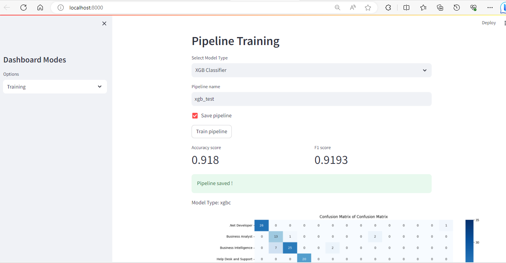

# DNA Engineering ML Home Assignment

## Requirements

- Python 3.9 or higher.

#### - Install pipenv on your global python setup

```Python
    pip install pipenv
```

Or follow [documentation](https://pipenv.pypa.io/en/latest/install/) to install it properly on your system

#### - Install requirements

```sh
    cd data-ml-home-assignement
```

```Python
    pipenv install
```

```Python
    pipenv shell
```

#### - Start the application

```sh
    sh run.sh
```

- API : http://localhost:8000
- Streamlit Dashboard : http://localhost:8000

P.S You can check the log files for any improbable issues with your execution.

## Before we begin

- In this assignement, you will be asked to write, refactor, and test code.
- Make sure you respect clean code guidelines.
- Some parts of the already existing code are bad. Your job is to refactor them.
- Read the assignement carefully.
- Read the code thoroughly before you begin coding.

## Description

This mini project is a data app that revolves around resume text classification.

You are given a `dataset` that contains a number of resumes with their labels.

Each row of the dataset contains:

- Label 1, 2, ..., 13 You will find the resume labels map under src/constants
- Resume text

The project contains by default:

- A baseline `naive bayes pipeline` trained on the aforementioned dataset
- An `API` that exposes an `inference endpoint` for predictions using the baseline pipeline
- A streamlit dashboard divided on three parts `(Exploratory Data Analysis, Training, Inference)`

## Assignment

### 1 - Code Refactoring

`Streamlit` is a component-based data app creator that allows you to create interactive dashboards using Python.

While Streamlit is easy to use by "non frontenders", it can easily turn into a complicated piece of code.

As mentioned previously, the streamlit dashboard you have at hand is divided into 3 sections:

- Exploratory Data Analysis
- Training
- Inference

The code for the dashboard is written into one long Python (`dashboard.py`) script which makes it long, unoptimized, hard to read, hard to maintain, and hard to upgrade.

Your job is to:

- Rewrite the code while respecting `clean code` guidelines.
- `Refactor` the script and dissociate the components.
- Create the appropriate `abstraction` to make it easy to add components on top of the existing code.

`Bonus points`: if you pinpoint any other code anomalies across the whole project and correct them.

### 2 - Exploratory Data Analysis

In this section, you are asked to explore the dataset you are provided and derive insights from it:

- Statistical Descriptions
- Charts

Your EDA must be added to the first section of the streamlit dashboard.

P.S: You can add data processing in this section if needed.


Hints: Please refer to the [documentation](https://docs.streamlit.io/library/api-reference) to learn more on how to use Streamlit `widgets` in order to display: `pandas dataframes`, `charts`, `tables`, etc, as well as interactive components: `text inputs`, `buttons`, `sliders`, etc.

### 3 - Training

In this section, you are asked to `beat` the baseline pipeline.

The trained pipeline is a combination of a Count Vectorizer and a Naive Bayes model

The goal is to capitalize on what you have discovered during the `EDA phase` and use the insights you derived in order to create a pipeline that performs `better` than the baseline you were provided.

The higher the `F1 score` the better.

You can `trigger` the baseline pipeline `training` in the `second` section of the `dashboard`.

Choose the `name` of the pipeline and whether you want to `serialize` it.


Click `Train pipeline` and wait until the training is done...


Once done, you will be able to see the F1 score as well as the confusion matrix.

P.S: If you chose the `save option` at the beginning of the training, you will be able to see the serialized pipeline under `models/pipeline_name`




Hints:

- Make sure to change the training pipeline before you can trigger the training of your own from the dashboard.
- Make sure to add a vectorization method to your pipeline if missing.
- Your model must respect the abstraction used to build the baseline

### 4 - Inference

`Inference` is just a fancy word to say `prediction`.

In the third section of the dashboard, you can `choose` different `resumes` and run the serialized pipeline against them.


The example shows an inference for a Java Developer resume:


In this section, you are asked to:

- Create an `endpoint` that allows you to `save` the prediction results into a `SQlite table`.
- Display the `contents` of the SQlite table after each inference run.

Hints: Think about using `SQLALchemy`

Install `fastapi-cors` :

FastAPI-CORS is a library that simplifies handling Cross-Origin Resource Sharing (CORS) in your FastAPI applications. To install it, use the following command:

- `pip install fastapi-cors`

### 5 - Unit testing

As mentioned previously, your code should be unit tested.

Hints: Use `pytest` for your unit tests as well as `mocks` for external services.

For unit testing , you'll need the following installation:

- `pip install pytest`
- `pip install pytest-mock`
- `pip install requests-mock`

To check if everything is set up correctly, and report the test results run this command:

- `pytest tests/test_dashboard.py`
